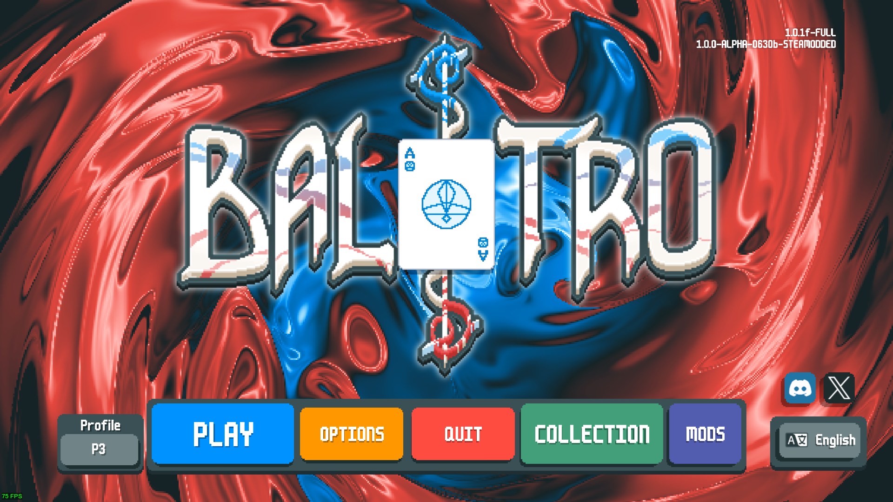
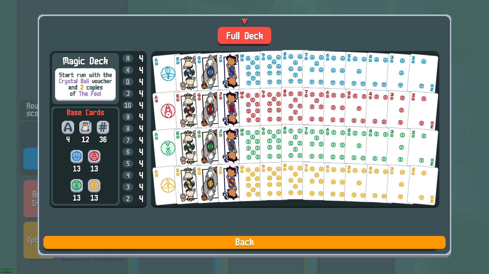
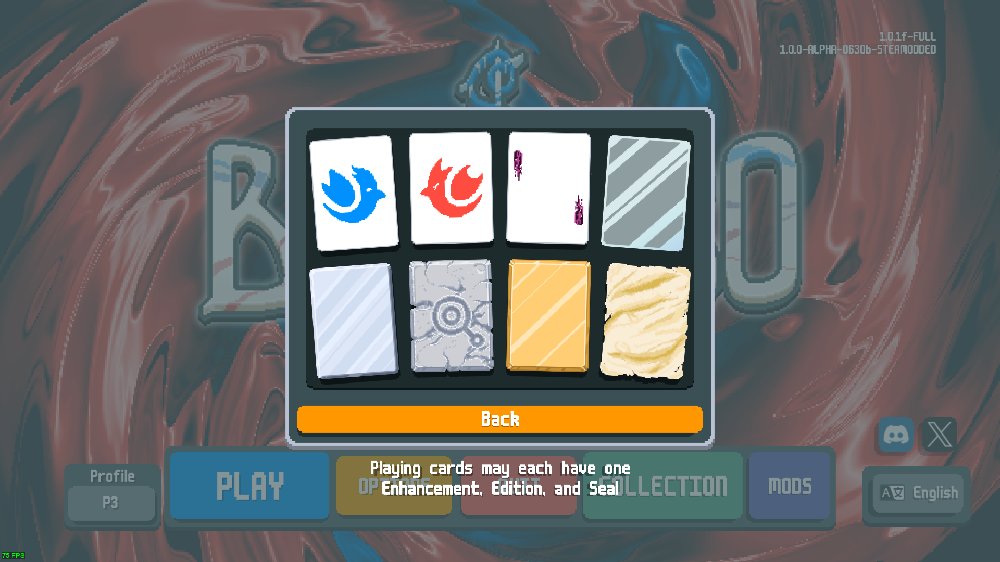

# The Owl House Mod for Balatro

Original Mod Repository: https://github.com/DaviAMSilva/BalatroTheOwlHouseMod

This is a Balatro texture mod featuring characters and symbols from the Disney Television Animation show, [The Owl House](https://www.imdb.com/title/tt8050756/).

YouTube video: [The Owl House Mod - Balatro Mod Showcase](https://youtu.be/c9bnxKF73fo)

## Changes

- Replaced the suits and aces with the 4 glyphs from the show: **[Ice](https://theowlhouse.fandom.com/wiki/Ice_Glyph)**, **[Fire](https://theowlhouse.fandom.com/wiki/Fire_Glyph)**, **[Plant](https://theowlhouse.fandom.com/wiki/Plant_Glyph)** and **[Light](https://theowlhouse.fandom.com/wiki/Light_Glyph)**
- Replaced the face cards with the main characters: **[King](https://theowlhouse.fandom.com/wiki/King)**, **[Eda](https://theowlhouse.fandom.com/wiki/Eda_Clawthorne)** and **[Luz](https://theowlhouse.fandom.com/wiki/Luz_Noceda)**
- Replaced the Mult Card enhancement texture with **[Flapjack](https://theowlhouse.fandom.com/wiki/Flapjack)**
- Replaced the Bonus Card enhancement texture with **[Waffle](https://theowlhouse.fandom.com/wiki/Waffle)**
- Added the Titan symbol to the Stone Card texture
- Added a abomination color scheme to the Wild Card texture

## Installation

This mod requires [Steamodded](https://github.com/Steamopollys/Steamodded/) to work and was tested on the 1.0.0-ALPHA version.

The mod files are available to download on the [releases page](https://github.com/DaviAMSilva/BalatroTheOwlHouseMod/releases). Installation instructions are better described in the [Steamodded](https://github.com/Steamopollys/Steamodded) repository.

## Screenshots

